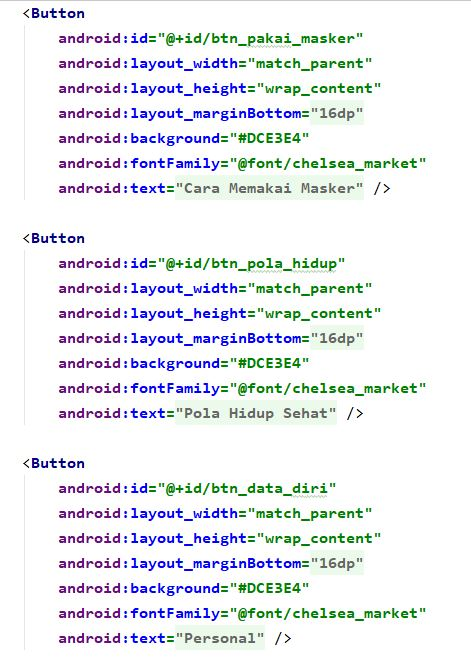
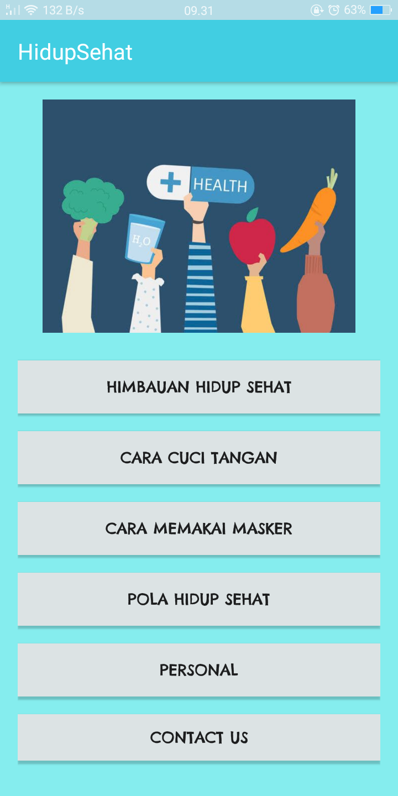
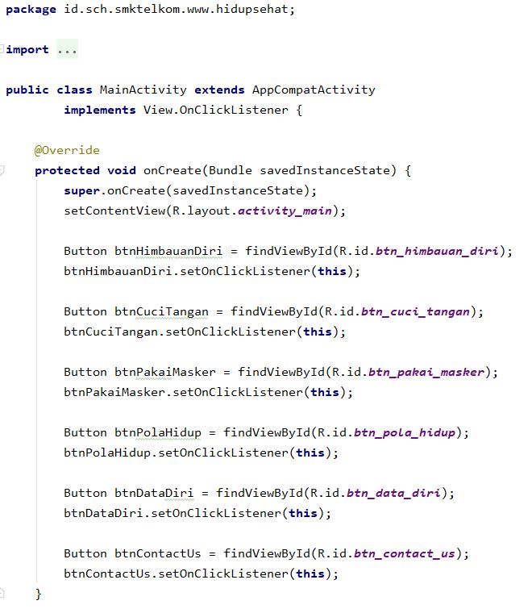
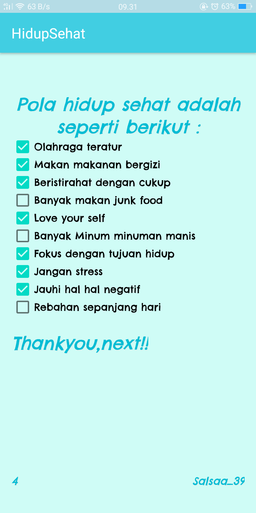

# HidupSehat
# Tugas Materi Intent

A. activity_main.xml

-code

berisi kode untuk tampilan menu utama

menghasilkan design seperti ini :
 

hasil tampilan awal

B. MainActivity.java

Berisi kumpulan baris yang tertera berfungsi untuk memperkenalkan button yang sudah ditambahkan di layout activity_main.xml dan beberapa baris untuk menambahkan event onClick pada btn dengan java

C. string.xml

String.xml berisi kumpulan string yang diperlukan

D. dimen.xml

Berisi margin pada kode

Isi button himbauan

berisi penerapan modul 9

activity_himbauan_diri.xml

hasil :

Isi button Cara Cuci Tangan

 berisi penerapan modul 9
 
 activity_cuci_tangan.xml
 
 

hasil :

 
 
 Isi button Cara Memakai Masker
 
 berisi penerapan modul 9
 
 activity_cuci_tangan.xml
 
  
  
  hasilnya :
  
   
   
 Isi button Pola Hidup Sehat
 
 penerapan modul 9
 
 activity_pola_hidup.xml
 
   
   
   terdapat checkbox agar kita bisa memilih mana yang pola hidup sehat dan mana yang bukan seperti ini :
   
   
     
Isi button Person

penerapan modul 10

DataDiri.java

activity_data_diri.xml

hasilnya seperti ini :

Isi button Contact Us

penerapan modul 11

berisi panggilan menuju nomor 112 (nomor panggilan darurat) seperti berikut :

sekian, mohon maaf bila ada kesalahan dan kekurangan

terimakasih

# Salsabilla Maurettasya A
# 39 - XI RPL 3
   
  
 

